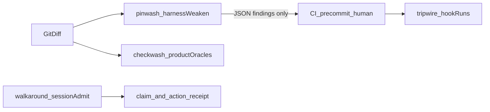
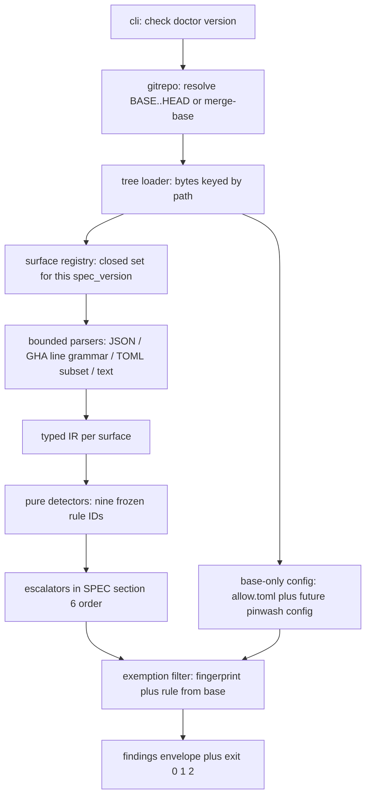
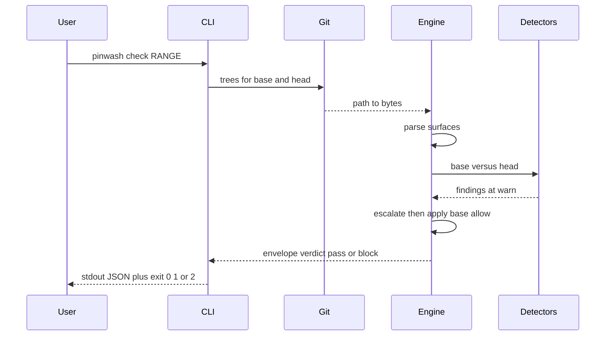

# pinwash architecture

**North star:** on a pair of git trees (`base` / `head`), using a closed surface set and a closed rule-ID set, flag harness weakenings that make an agent more able to claim done. The verdict is replayable: no network, no LLM, no subject execution.

This file explains layers and evolution. It does **not** add rules, surfaces, exit codes, or acceptance criteria.

**Conflict rule:** [SPEC.md](SPEC.md) wins. [THREATMODEL.md](THREATMODEL.md) owns residual rows. Frozen acceptance is [tests/gates/test_v0_acceptance.py](tests/gates/test_v0_acceptance.py). Coding agents have read-only authority over SPEC and `tests/gates/**`. If this file disagrees with SPEC, SPEC is correct and this file is wrong.

SPEC's opening records the local engine and the 2026-09-27 delegated edit authority. This checkout has a **local v0 engine** at `0.0.0` / spec `4` (each bump is its own commit with a changelog entry in SPEC §16). That is not a Release, not PyPI, and not a 1.0 claim.

## 0. What this product is allowed to be

pinwash is a static, local, deterministic **diff scanner**. It judges **harness weakening**, not product tests, not claims, not journeys, not whether a hook actually ran.

It never emits `SECURE`, `HARNESS_INTACT`, `HONEST`, `COMPLETE`, or `ENFORCED`. The strongest valid pass sentence is SPEC §0:

> No in-scope weakening finding at or above `fail_on` was observed on this base/head pair, under this spec version, surface set, and pinwash revision.

A1–A11 holding does **not** license a public 1.0 (SPEC §12).

## 1. Neighbours (do not reimplement)



| Product | Question pinwash does not answer |
|---|---|
| checkwash | Did this diff weaken product tests / CI oracles? |
| walkaround / action-receipt / claim-receipt-lab | Did the agent enter a contract or emit a receipt for a done-claim? |
| phaseledger | Did a measurer allow a phase advance? |
| charterlock | Was the journey allowed to be the exam? |
| tripwire | Is a hook actually executing a pinned judge on this host? |
| boundkit | Was the task claimed and authorized? |
| smallestlie | What lie does this verifier still accept? |

On one diff, checkwash may emit a guardrail-touch event and pinwash may emit a structured weakening. Identities must not be shared. tripwire may **invoke** pinwash; enforcement belongs to tripwire. pinwash does not install, invoke, or trust hooks.

## 2. Trust boundaries (invariants)

1. The **head** tree — including the working tree — is attacker-controlled. Agents write it.
2. **Configuration and allowlists are read from the base side only.** A head-side disable does not govern the run that reviews that head. Creating a base-absent config that relaxes defaults is itself a finding (`CONFIG_RELAXED`).
3. The core path **reads bytes**. It never executes subject code, hooks, judges, workflows, MCP servers, or skills. It never uses a network. It never calls a model.
4. GitHub rulesets that exist only on an API and not as a file in the trees are residual R05: `UNKNOWN`, not pass and not block.
5. The analysis unit is a **diff** (`base`/`head`). pinwash never judges a single snapshot as “the harness is fine”.
6. Missing observation is never a pass: unobservable inputs surface as `SURFACE_UNPARSEABLE` findings, `config_errors` entries, or `unknown_coverage` rows. A crashed engine is exit **2**, never a block (exit 1). Subject-surface parse failure is `SURFACE_UNPARSEABLE`, not exit 2, unless git itself cannot be read.
7. Artifacts the agent wrote in the same diff (logs, screenshots, “CI is green” prose) are never evidence that a harness still runs.

The only clock that may affect a verdict is exemption expiry on **base** `.pinwash/allow.toml`, overridable with `PINWASH_TODAY` for replay.

Range notation matches checkwash: `BASE..HEAD` is tree-to-tree; `BASE...HEAD` is `merge-base(BASE, HEAD)..HEAD` and must not silently become two-dot. Paths use forward slashes. Comparison text is CRLF→LF before parse.

## 3. Runtime layers

### 3.1 Target shape (1.0 module layout — not implemented in this checkout)

Adding a surface must be: spec bump + one registry row + one parser + one detector. Not another loop in a thousand-line engine.



Suggested split **when** a later change actually refactors (this file does not schedule that diff):

- `pinwash/parse/` — `gha`, JSON surfaces, TOML subset, hook command strings
- `pinwash/rules/` — one module per frozen rule ID
- `pinwash/escalate.py` — SPEC §6 only
- `pinwash/allow.py` — base `.pinwash/allow.toml`
- `pinwash/engine.py` — orchestration only

Public JSON fields and the fingerprint formula stay frozen in SPEC §7. A refactor that changes fingerprint semantics is a spec bug.

### 3.2 What this checkout actually has

| Layer | Duty | Code today |
|---|---|---|
| CLI | Dispatch; unexpected exceptions → exit 2 | `pinwash/cli.py` |
| Git adapter | Two-dot / three-dot; tree bytes; unreadable git → `GitError` | `pinwash/gitrepo.py` |
| Surface registry | Path → membership in the v0 closed set | `pinwash/surfaces.py` |
| Bounded parsers | Not YAML 1.2, not full TOML, no executing Python | `pinwash/gha.py`, `pinwash/tomlsub.py`, stdlib JSON |
| Typed IR | Detectors must not see raw YAML | **Missing** — 1.0-shape gap |
| Detectors | `(base_ir, head_ir, path) → drafts`; no I/O | `pinwash/engine.py` `_detect_*` |
| Escalators | SPEC §6 order; no scores | Inlined in those detectors |
| Allow | Fingerprint + rule; never a rule-glob | `pinwash/engine.py` `_apply_allow` |
| Envelope | Stable sort keys; no clock; no floats | `pinwash/findings.py` |

`engine.py` currently owns parse dispatch, every detector, escalation, allow, and envelope assembly. That is acceptable for local v0. It is not the 1.0 shape.

## 4. Data flow



- `pinwash check` with no range: `HEAD` versus worktree. Worktree is the attack surface (tracked and untracked, `--exclude-standard`).
- Default `fail_on` is `high`. `warn` does not fail the run (A6: phrase hit on skill markdown is warn, exit 0). `PERMISSION_WIDENED` and `CONFIG_RELAXED` escalate to **high**. Last remaining Stop-like hook, last remaining required context, or last non-floating pin on a workflow (when floated) escalate per SPEC §6.
- stdout JSON is the **only machine API**: UTF-8, sorted keys, `ensure_ascii=False`, newline `\n`. Human reports may degrade glyphs; machine JSON may not.
- `unknown_coverage` does not change `verdict`. A consumer that requires “no unknown coverage” is **consumer policy**, not this spec.
- `pinwash_findings_version` is `1`. `spec_version` tracks SPEC §16 (currently `4`). `pinwash_version` is `0.0.0`.

## 5. Surfaces, parsers, detectors (v0 closed set)

Adding a surface or a rule ID is a spec bump. v0 rule IDs (and no others in the `rule` field):

`HOOK_REMOVED` · `HOOK_BYPASSED` · `GATE_STUBBED` · `JUDGE_UNPINNED` · `PERMISSION_WIDENED` · `SKILL_BYPASS` · `REQUIRED_CHECK_DROPPED` · `CONFIG_RELAXED` · `SURFACE_UNPARSEABLE`

Internal helper names must not appear in JSON `rule`.

| Surface ID | Paths | Parse | Detectors |
|---|---|---|---|
| `claude_settings` | `.claude/settings.json`, `.claude/settings.local.json` | JSON object | hook trio; `PERMISSION_WIDENED` |
| `claude_hooks` | `.claude/hooks/**` plus §3.3-resolved command targets (restored in spec 4) | JSON if `.json`, else command string | parse status; §5.2 closed-set body stubs feed `GATE_STUBBED` and the last-Stop escalator |
| `cursor_hooks` | `.cursor/hooks.json` | JSON object | hook trio |
| `cursor_mcp` | `.cursor/mcp.json`, `.mcp.json` | JSON object | `PERMISSION_WIDENED` |
| `agent_markdown` | `AGENTS.md`, `CLAUDE.md`, `.cursorrules`, `.cursor/rules/**/*.mdc`, `.cursor/rules/**/*.md` | UTF-8 text | `SKILL_BYPASS` only |
| `skill_md` | `**/SKILL.md` and the two skill trees named in SPEC §3 | UTF-8 text | `SKILL_BYPASS` only |
| `gha_workflow` | `.github/workflows/*.{yml,yaml}` | bounded line grammar, not YAML 1.2 | job drop / `if: false` / `continue-on-error` — job side fires only for jobs producing a base-named ruleset context (SPEC §5) |
| `action_pin` | same workflow files | `uses:` lines in that grammar | `JUDGE_UNPINNED` |
| `gha_ruleset` | `.github/required-ruleset.json`, `.github/rulesets/*.json` | JSON object | `REQUIRED_CHECK_DROPPED` |
| `declared_pins` | `.pinwash/pins.json` (optional) | JSON array of pin records | `JUDGE_UNPINNED` |
| `checkwash_config` | `.checkwash/config.toml`, `.greenwash/config.toml` | bounded TOML subset | `CONFIG_RELAXED` |

Files outside these paths are invisible to v0. A harness that lives only in `$HOME`, a SaaS UI, or a gitignored local settings file is residual R02.

`.pinwash/allow.toml` is the **exemption channel**, not a §3 surface. Today `pinwash/surfaces.py` lists it in `EXACT` so the tree loader keeps the bytes. Architecturally it is config, not a detection surface. Head-side append-only additions are visibility only; the current run still trusts **base**.

`SKILL_BYPASS` compares **added or edited lines** (not deletions) against the closed phrase table in SPEC §5.4. Documentation of those phrases in `SPEC.md` / `THREATMODEL.md` / `README.md` is excluded by path. **This file is not in that exclude set.** Do not paste the phrase table here. Extra exclude globs are a spec bump.

If a surface file existed at base and is unparseable at head under that surface’s parse: `SURFACE_UNPARSEABLE` high. Unparseable on both sides: warn.

### 5.1 Bounded GHA grammar (v0)

After CRLF→LF: drop comment lines; spaces-only indent (tabs → unparseable for that file); record `uses:`, `continue-on-error:`, `if:`, job keys, and job `name:` under the stack in SPEC §3.1.

Residuals, not findings, not passes: YAML aliases, multiline scalars, `uses` split across lines, `true` written as `yes`, jobs generated by reusable workflows, `workflow_call` indirection. Those are `unknown_coverage`. The engine must not invent “no `uses` change” from an unparsed construct.

### 5.2 Pin identity

A pin is `{locator, kind, value, product?}` as in SPEC §4. Locator examples must stay stable across reformatting.

Kind lattice, stronger to weaker:

```
digest_sha256 > git_sha (full 40 hex) > git_tag > action_ref-that-is-tag > floating
```

`JUDGE_UNPINNED` is kind moved down the lattice; value changed to floating; pin removed while the consumer still exists; digest present at base and absent at head; SHA shortened below 40 hex.

Tightening (tag → sha, sha + digest added) is not a finding. Vendor-directory **content** edits without a pin-record change are residual R04 in v0.

`.pinwash/pins.json` is optional. Head-only creation is not a finding. If present at base, every record must keep kind/value or a documented allow fingerprint.

Fingerprint (exemption key): `rule/path/v1:` plus hex sha256 of canonical JSON `{rule, path, locator, before_digest, after_digest}`. Allow entries are per fingerprint, never per-rule-glob; `reason` and `expires` required; `expires` at most 180 days.

## 6. Exit codes and determinism

| Exit | Meaning |
|---|---|
| 0 | No finding at or above `fail_on`; engine finished |
| 1 | Verdict `block` |
| 2 | Engine error, including unexpected exceptions and unreadable git trees |

No floats in the verdict path. No network. No clock in findings JSON (exemption date is the exception above). No random. Zero runtime dependencies. JSON bytes identical on Windows / macOS / Linux for the same trees and Python 3.11–3.13 (A10).

## 7. Consumers (outside the core)

pinwash may be **wrapped** by a hook or a CI job. It remains not an enforcer. Job failure on exit 1 is **repository policy**.

| Consumer | How | What it is not |
|---|---|---|
| Local / pre-commit | `python -m pinwash check` or `HEAD~1..HEAD` | Proof the remaining harness works |
| PR CI | Runner already has two trees; run `BASE...HEAD` | pinwash executing a GitHub required check |
| tripwire Stop | May shell out to pinwash | Closing residual R01 (a host CLI that never consults repo hooks) |

Forbidden consumer fantasies:

- Call a GitHub ruleset API to close R05.
- Call a model to close R08.
- Auto-fix the diff (another product).
- Treat `unknown_coverage` as pass.

`doctor` (SPEC §13): own tests **and** spec hash; must not judge the subject (`subject_judged: false`). It runs this package's unittest suite in-process under a `PINWASH_DOCTOR_SELFTEST` guard (the gate suite spawns `pinwash doctor`, so the guard stops a doctor running inside its own test run from recursing); own-test failure is exit 2.

## 8. v0 held versus 1.0 license

**Held locally, informal:** `python -m pinwash check`; A1–A11 in stdlib unittest; no network; exit 0/1/2. Keep the version string `0.0.0 spec 0` until a human bumps it.

**1.0 license (every item is a human decision; missing one forbids saying 1.0):**

1. ~~Human edits SPEC's "No engine exists yet"~~ Held: updated in spec 3 under the 2026-09-27 delegation (own commit; A11's original constraint — the first satisfying engine PR did not touch SPEC — still holds historically).
2. ~~Prefer `spec_version >= 1` over a footnote "spec 0 + engine 1.0"~~ Held: `spec_version` is `3`.
3. THREATMODEL R01–R10: each row is **Closed** with a named fixture, or **Permanent** with a human signature that it will not be closed and will not be pretended closed. Closed without a fixture fails the suite.
4. Findings envelope and fingerprint stay backward compatible (`pinwash_findings_version: 1` already).
5. `doctor` actually runs this package’s tests. (Held in v0 as of this change set; the item stays on the list as a 1.0 check.)
6. At least one consumer recipe that quotes the pass sentence plus spec version plus pinwash revision.
7. A10-class determinism still holds.
8. Public language follows SPEC §14.

**Still forbidden on the core path at 1.0:** live GitHub / Cursor APIs, LLM classification of skills, a full YAML 1.2 parser, replacing checkwash, auto-fix, treating UNKNOWN as pass.

## 9. Spec-bump candidates (not 1.0 tickets)

Each is its own SPEC change plus fixture re-run. Detectors must not be patched to fit a fixture. Fixtures that are out of spec stay residuals.

1. ~~**R07 (highest-value hole):** bounded scan of hook **file bodies** pointed at by repo-relative commands, bundled with command-target resolution~~ **Done in spec 4** (closed §3.3 resolution rule, closed §5.2 body stub sets, body-aware last-Stop escalator). R07 stays Open for stub shapes outside the closed lists and opaque command forms — a further widening is its own bump.
2. **R06:** new agent hosts as new surface tables (one host, one bump).
3. **R03:** widen the **bounded** GHA grammar (still not YAML 1.2). Multiline `uses` becomes decidable only after the grammar actually covers it.
4. **R04:** if `pins.json` declares a digest, a vendored-judge byte change may become `JUDGE_UNPINNED`; undeclared content edits stay residual.
5. **R08:** extra exclude globs or a narrower phrase table — still no model.
6. Optional: base-only `.pinwash/config.toml` for pinwash’s own `fail_on`, distinct from the subject’s checkwash config.

Default **Permanent** at 1.0 unless a human closes them with fixtures: R01 (host CLI ignores repo hooks), R02 (harness only in home / SaaS / gitignored local), R05 (live ruleset not in trees), R09 (required-check rename with no ruleset file), R10 (pinwash not run).

## 10. Debt against this architecture (honest, not a silent SPEC patch)

- ~~SPEC and THREATMODEL still describe an unshipped engine.~~ Held in spec 3 / this change set: SPEC's preamble and THREATMODEL's header now record the local engine; A11's original constraint (the first satisfying engine PR did not touch SPEC) still holds historically.
- The engine may emit `EXEMPTION_ADDED` for head-side allow.toml appends. SPEC §5 says no other v0 rule IDs. Before 1.0 a human must either add it to §5 or demote it to `unknown_coverage` / `config_errors` visibility so it is not a `rule`. (SPEC §10 does name `EXEMPTION_ADDED`; the two sections need one human ruling.) → **Ruled 2026-09-27 (delegated): `EXEMPTION_ADDED` is a §5 rule as of spec 1**, and §10 validity now defines which allow.toml records count on both the addition and the edit/delete checks (implemented with verbatim record comparison, so a same-fingerprint edit is critical).
- SPEC §1.6 called a missing observation `INCOMPLETE`, but the §7 severity enum has no such value. → **Ruled 2026-09-27 (delegated): the token is removed as of spec 2.** The fail-closed invariant stays and is carried by the three existing channels; no detector or envelope change.
- Fidelity fixes in this change set (engine side only; SPEC untouched): `SURFACE_UNPARSEABLE` now follows the §3 closed table on every surface including `.claude/hooks/**` and `.pinwash/pins.json`; a deleted or unparseable head `allow.toml` with base exemptions is `CONFIG_RELAXED` critical; job-side `REQUIRED_CHECK_DROPPED` is ruleset-linked per §5; declared `action_ref` pins rank per the §4 lattice; a commented-out hook command is the v0 closed shape of "command prefixed with a no-op" (`HOOK_BYPASSED`, and non-live for the last-Stop escalator); a corrupt or absent baseline no longer produces invented findings on `cursor_mcp` / `claude_settings` permissions.
- ~~Still open: hook `command` strings that resolve to repo-relative files...~~ **Resolved in spec 4:** §3.3 restores target resolution with a closed tokenizer rule, and §5.2 body stubs wire into `GATE_STUBBED` and the last-Stop escalator.
- No typed IR; escalators are not centralized.
- `gitrepo.ls_tree` calls `git show` per blob (N+1). A later `cat-file --batch` does not change the analysis unit.
- `.pinwash/allow.toml` is mixed into the surface `EXACT` set.

## 11. Non-goals that stay non-goals

SPEC §15 for spec 0, and the core-path ban in §8 of this file for any later 1.0:

- Enforcing hooks (tripwire).
- Parsing Python/JS hook bodies (until a spec bump names R07 closed).
- LLM classification of skills.
- Live GitHub / Cursor API reads.
- Replacing checkwash CI/test rules.
- Auto-fixing the diff.
